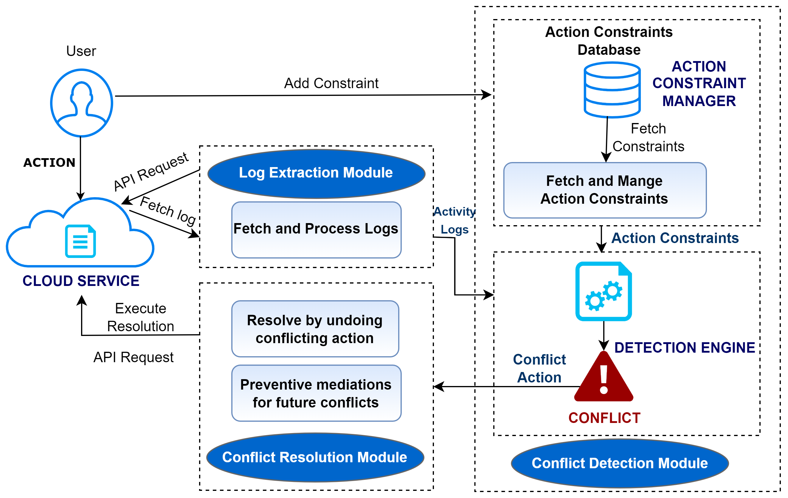

# ACCORD - Action Constraint-based Conflict Resolution and Detection

ACCORD is a web-based application that seamlessly interfaces with Google Drive to enhance collaboration and conflict resolution in shared resources within an organization. It empowers collaborators by accurately identifying conflicts and recommending suitable resolutions through a user-friendly interface.

## Overview

In a collaborative environment, users sharing resources in cloud services like Google Drive may sometimes perform actions that are in conflict with the expectations of others. ACCORD is designed to address this limitation by monitoring changes in access permissions and the content of the shared resources. It achieves this by using predefined rules known as Action Constraints, which are formulated by users to define permissible actions for others on shared resources.

When ACCORD detects a conflict, it alerts the user who set the action constraints and provides resolution strategies. Unlike native cloud service capabilities, ACCORD goes a step further by tracking file movements, auditing instances where files are moved to non-predefined locations, and monitoring edits to the file, especially outside of given date or time parameters.

## Modules

ACCORD is comprised of three main modules:

1. **Log Extraction Module**: This module acquires and processes activity logs from Google Drive.
   
2. **Conflict Detection Module**: This module includes:
    - **Action Constraints Manager**: Allows users to specify fine-grained permissions on shared resources.
    - **Detection Engine**: Identifies conflicts using data from activity logs and set action constraints.
   
3. **Conflict Resolution Module**: Recommends and executes resolution strategies based on the identified conflicts and involved users. The effectiveness of the resolution strategy depends on various factors such as user permissions, organizational settings, and actions performed post-conflict.

## Directory Structure

The project repository contains the following directories:

- `static/`: Contains subdirectories for different static assets
  - `css/`: Contains CSS stylesheets
  - `img/`: Contains images
  - `js/`: Contains JavaScript files
- `templates/`: Contains HTML template files for the application

